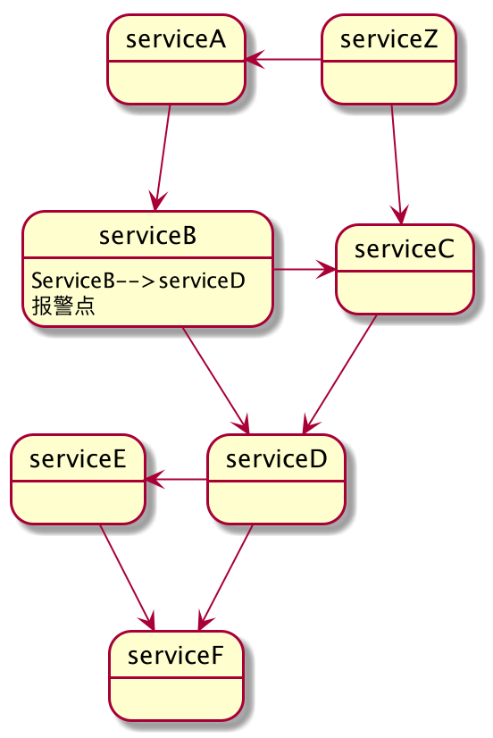

# 复赛赛题
**在开始coding前请仔细阅读以下内容**

## 赛题背景
在热身赛和初赛中同学们解决了微服务监控领域最基础的指标计算问题，决赛环节我们需要利用之前的一些积累来解决微服务监控领域遇到的更有挑战的问题。

## 题目内容
- 实现一个报警检查程序，输入一组报警规则和一个监控文件路径，触发器负责分析监控数据并返回所有的触发的报警的数据。
- 实现一个报警关联分析程序，输入为报警检查程序（上一问）返回的报警触发点信息，输出该报警影响的最长调用链路（可能存在多条最长路径，需要输出全部）。

## 数据和输入输出说明：
#### 数据类型定义
  - P99：同热身赛，详情请点击 [热身赛链接](https://kcode-git.kuaishou.com/kcode/kcode-warm-up/-/blob/master/README.md)  
  - 成功率：为了方便表示下面用SR（Success Rate）表示， 定义同初赛，详情请点击 [初赛链接](https://kcode-git.kuaishou.com/kcode/KcodeRpcMonitor/-/blob/master/README.md)  

#### 报警检查数据说明
- 报警规则数据格式
报警规则以字符串集合方式输入，字符格式描述如下：

```
规则编号,主调服务名,被调服务名,数据类型,触发条件,阈值
1,serviceB,serviceC,SR,3<,99.9%
2,ALL,serviceC,P99,2>,300ms
3,serviceB,ALL,P99,1>,350ms

规则编号：全局唯一，用于标记一个报警规则，int类型
主调服务名：一个具体的主调服务名称或者ALL，ALL代表这个规则对所有的主调生效
被调服务名：一个具体的被调服务名称或者ALL，ALL代表这个规则对所有的被调生效 【备注：主调服务名 和 被调服务名不会同时为ALL】
数据类型：本题中只有两种, 分布是：P99 和 SR
触发条件：连续发生分钟数+比较条件， 例如：“3<” 表示目标数据连续3分钟小于阈值就触发报警。比较条件类型有：> , <  两种
阈值：数据类型类型会有两种数据，P99对应是ms，SR表示百分比

规则示例解读：
以编号1为例：serviceB调用serviceC的成功率连续3分钟小于99.9%则报警
以编号2为例：serviceC作为被调时，如果有P99连续2分钟大于300ms则报警
以编号3为例：serviceB作为主动时，如果下游任何被调有P99连续1分钟大于350ms则报警

```
**报警阈值计算是以主被调ip对聚合，聚合时间粒度为1分钟**


- 监控数据格式（同初赛）
```
每个调用记录存储在一行，数据直接以逗号分割(,), 换行符号(\n)，为了便于观察数据加了分钟信息备注「2020-06-18 12:33」，实际数据不会有

主调服务名,主调方IP,被调服务名,被调方IP,结果,耗时(ms), 调用时间戳(ms)
serviceA,172.17.60.2,serviceB,172.17.60.3,true,20,1592454780000「2020-06-18 12:33」
serviceA,172.17.60.2,serviceB,172.17.60.3,true,30,1592454780000「2020-06-18 12:33」
serviceA,172.17.60.2,serviceB,172.17.60.3,true,50,1592454900000「2020-06-18 12:34」

serviceZ,172.17.60.8,serviceA,172.17.60.2,true,420,1592454780000「2020-06-18 12:33」
serviceZ,172.17.60.8,serviceC,172.17.60.4,true,120,1592454780000「2020-06-18 12:33」
serviceB,172.17.60.3,serviceC,172.17.60.4,true,360,1592454780000「2020-06-18 12:33」
serviceB,172.17.60.3,serviceC,172.17.60.4,true,380,1592454780000「2020-06-18 12:33」
serviceB,172.17.60.3,serviceC,172.17.60.4,true,390,1592454840000「2020-06-18 12:34」
serviceB,172.17.60.3,serviceC,172.17.60.4,true,395,1592454840000「2020-06-18 12:34」
serviceB,172.17.60.3,serviceC,172.17.60.4,true,393,1592454900000「2020-06-18 12:35」
serviceB,172.17.60.3,serviceC,172.17.60.4,true,404,1592454900000「2020-06-18 12:35」
                                                                                 
serviceB,172.17.60.3,serviceD,172.17.60.5,true,120,1592454780000「2020-06-18 12:33」
serviceB,172.17.60.3,serviceD,172.17.60.5,true,430,1592454840000「2020-06-18 12:34」
serviceB,172.17.60.3,serviceD,172.17.60.5,true,400,1592454840000「2020-06-18 12:34」
serviceB,172.17.60.3,serviceD,172.17.60.5,true,410,1592454840000「2020-06-18 12:34」
                                                                                 
serviceC,172.17.60.4,serviceD,172.17.60.5,true,241,1592454780000「2020-06-18 12:33」
serviceC,172.17.60.4,serviceD,172.17.60.5,true,345,1592454840000「2020-06-18 12:34」
serviceC,172.17.60.4,serviceD,172.17.60.5,true,260,1592454840000「2020-06-18 12:34」
serviceC,172.17.60.4,serviceD,172.17.60.5,true,350,1592454900000「2020-06-18 12:35」
serviceC,172.17.60.4,serviceD,172.17.60.5,true,140,1592454900000「2020-06-18 12:35」

serviceD,172.17.60.5,serviceE,172.17.60.4,true,102,1592454900000「2020-06-18 12:35」
serviceE,172.17.60.4,serviceF,172.17.60.4,true,110,1592454900000「2020-06-18 12:35」
serviceD,172.17.60.5,serviceF,172.17.60.4,true,120,1592454900000「2020-06-18 12:35」

```

- 报警信息输出，报警检查程序需要返回一个报警信息的集合，用字符串描述
```
规则编号,报警触发时间（分钟）,主调服务名,主调IP, 被调服务名, 被调IP, 报警值
2,2020-06-18 12:34,serviceB,172.17.60.3,serviceC,172.17.60.4,395ms
2,2020-06-18 12:35,serviceB,172.17.60.3,serviceC,172.17.60.4,404ms

3,2020-06-18 12:33,serviceB,172.17.60.3,serviceC,172.17.60.4,380ms
3,2020-06-18 12:34,serviceB,172.17.60.3,serviceC,172.17.60.4,395ms
3,2020-06-18 12:35,serviceB,172.17.60.3,serviceC,172.17.60.4,404ms
3,2020-06-18 12:34,serviceB,172.17.60.3,serviceD,172.17.60.5,430ms

规则编号： 同上描述
报警触发时间：真正满足报警规则的时间点，例如：规则2，12:33开始p99已大于350ms，但是持续时间不够，那么报警触发时间应该是12:34
主调服务名：实际触发报警的主调服务，这里返回的不是ALL，必须是一个具体服务名称
被调服务名：实际触发报警的被调服务，这里返回的不是ALL，必须是一个具体服务名称
报警值：触发报警的的值（非报警规则阈值），例如：规则3报警阈值是350，但是时间报警值应该是大于350的某个值
```

#### 报警关联分析数据说明
 - 输入：触发报警调用信息的主调服务名、被调服务名、时间戳(分钟级)以及触发监控类型
 - 输出：该条报警影响的最长调用链路（可能存在多条最长路径，需要输出全部），以及整个链路上的监控值(该值为服务级别监控值)

示例1：
 - 输入：serviceB,serviceD,2020-06-18 12:33,SR
 - 输出：serviceZ->serviceA->serviceB->serviceD->serviceE->serviceF|100.00%,100.00%,100.00%,-1%,-1%
 - 输出说明：100.00%是serviceZ调用serviceA的成功率，其他监控值同理, 如果查询分钟恰好无调用返回-1% 【这里为服务粒度成功率，注意和第一问区别】
 
示例2：
 - 输入：serviceB,serviceD,2020-06-18 12:33,P99
 - 输出：serviceZ->serviceA->serviceB->serviceD->serviceE->serviceF|420ms,30ms,120ms,-1ms,-1ms
 - 输出说明：420ms是serviceZ调用serviceA的P99耗时，其他监控值同理，如果查询分钟恰好无调用返回-1ms【这里为服务粒度P99，注意和第一问区别】
  
图示举例说明：
 下图展示示例数据的完整调用图，经过serviceB，serviceD报警点最长调用链路，可以比较直观的看出,
 **只有在给出的数据中只要有过调用关系都属于有调用关系，和具体的分钟数无关**

 


## 操作说明
- 进入决赛队伍登录 https://kcode-git.kuaishou.com 可以直接看到决赛git项目，项目名称为：kcodeAlertAnalysis_xxxxxx
- 登录 https://kcode-git.kuaishou.com/ 或直接下载 [决赛初始代码](https://kcode-git.kuaishou.com/kcode/kcodealertanalysis)
- 将初赛初始代码相关文件提交到自己的参赛项目，项目名称为 kcodeAlertAnalysis_xxxxxxx，登录 https://kcode-git.kuaishou.com/ 可以获取
- pom.xml 中指定了打包插件(无需修改)
- KcodeAlertAnalysisImpl 中需要选手实现 alarmMonitor 和 getLongestPath 方法
- KcodeAlertAnalysisTest 用于选手本地测试，在参赛项目中无需提交
- ==相关的实现必须在 package com.kuaishou.kcode 下面，否则评测程序会发现不了你的实现==

## 评测环境&启动参数
- JDK 版本： 1.8
- jvm内存设置 : -XX:+UseG1GC -XX:MaxGCPauseMillis=500 -Xms6G -Xmx6G -XX:MaxDirectMemorySize=1G
- 评测机器硬件信息（docker）：
    - 操作系统 CentOS 7.3 64位
    - CPU	8核 3.00GHz
    - 硬盘：容量 100GB， 吞吐量 > 100MB/S
- 如果需要输出文件，请使用 /tmp/ 目录
  
## 评测标准&排名
- 系统会默认拉取每个参赛队伍git项目的master代码作为评测程序执行
- 评测数据规模是提供的本地评测数据集规模的**2-3倍**，**注意内存消耗**
- 线上评测数据时间戳不保证验证递增，乱序范围正负一分钟
- 决赛评测数据会有多份（包括报警规则），会多次new kcodeAlertAnalysisImpl对象进行评测，**不要使用static变量保存中间结果**
- 单个数据集成绩评测过程
  - 报警检查程序(alarmMonitor)：读取评测文件中全部记录N1条，报警检查耗时T1
  - 报警关联分析程序(getLongestPath)：执行查询次数N2次，报警关联分析程序T2
- 如果结果都正确，单次成绩为 N1/T1*系数 + N2/T2
- T1、T2均不能超过1800秒，否则无成绩
- 最终成绩：多个数据集评测成绩平均值作为最终成绩
- 评测系统会有一定的耗时抖动，排名成绩取最高成绩，鼓励同学在获取理想成绩后持续优化以博取更高成绩


## 要求和限制
- 题目语言限定为 **==Java==** 
- 不允许引入任何外部依赖，JavaSE 8 包含的lib除外
- 排名靠前的代码会被review，如发现大量copy代码或引入不符合要求的三方库，将扣分或取消成绩
- 禁止在代码中输出任何日志输出或是控制台输出，否则无成绩
- 上传与题目无关的代码，视为作弊，无成绩
- 面向数据集编程的代码会被扣分
- **决赛评测增加次数限制，每个队伍每天 5 次机会，提交代码需谨慎【评测自动触发】**

## 本地测试数据集
 为了模拟线上评测，决赛提供**两份**本地评测数据 （线上评测也会有多份数据）
 
 - 测试数据和评测数据1：为方便下载，将数据集切分为多个文件(要全部下载，才能正常解压)：
   - https://static.yximgs.com/kos/nlav10305/KcodeAlertAnalysis-data1/KcodeAlertAnalysis-data1.z01
   - https://static.yximgs.com/kos/nlav10305/KcodeAlertAnalysis-data1/KcodeAlertAnalysis-data1.z02
   - https://static.yximgs.com/kos/nlav10305/KcodeAlertAnalysis-data1/KcodeAlertAnalysis-data1.z03
   - https://static.yximgs.com/kos/nlav10305/KcodeAlertAnalysis-data1/KcodeAlertAnalysis-data1.z04
   - https://static.yximgs.com/kos/nlav10305/KcodeAlertAnalysis-data1/KcodeAlertAnalysis-data1.z05
   - https://static.yximgs.com/kos/nlav10305/KcodeAlertAnalysis-data1/KcodeAlertAnalysis-data1.z06
   - https://static.yximgs.com/kos/nlav10305/KcodeAlertAnalysis-data1/KcodeAlertAnalysis-data1.zip
 
 - 测试数据和评测数据2：为方便下载，将数据集切分为多个文件(要全部下载，才能正常解压)：
   - https://static.yximgs.com/kos/nlav10305/KcodeAlertAnalysis-data2/KcodeAlertAnalysis-data2.z01
   - https://static.yximgs.com/kos/nlav10305/KcodeAlertAnalysis-data2/KcodeAlertAnalysis-data2.z02
   - https://static.yximgs.com/kos/nlav10305/KcodeAlertAnalysis-data2/KcodeAlertAnalysis-data2.z03
   - https://static.yximgs.com/kos/nlav10305/KcodeAlertAnalysis-data2/KcodeAlertAnalysis-data2.z04
   - https://static.yximgs.com/kos/nlav10305/KcodeAlertAnalysis-data2/KcodeAlertAnalysis-data2.zip
   
 - 测试数据和评测数据(小集合):
   - https://static.yximgs.com/kos/nlav10305/KcodeAlertAnalysis-test/KcodeAlertAnalysis-data-test.zip
 
 - 文件名说明（以"测试数据和评测数据1"说明）：
   - kcodeAlertForStudent-1.data：监控数据
   - ruleForStudent-1.txt：报警规则
   - Q1Result-1.txt：第一问结果集
   - Q2Input-1：第二问输入
   - Q2Result-1.txt：第二问结果集

## 代码提交
需要将自己完成的代码push到  https://kcode-git.kuaishou.com/kcode/kcodeAlertAnalysis_xxxxxxx  项目下的master分支


## 评测问题说明

